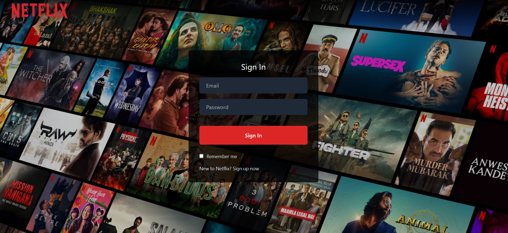
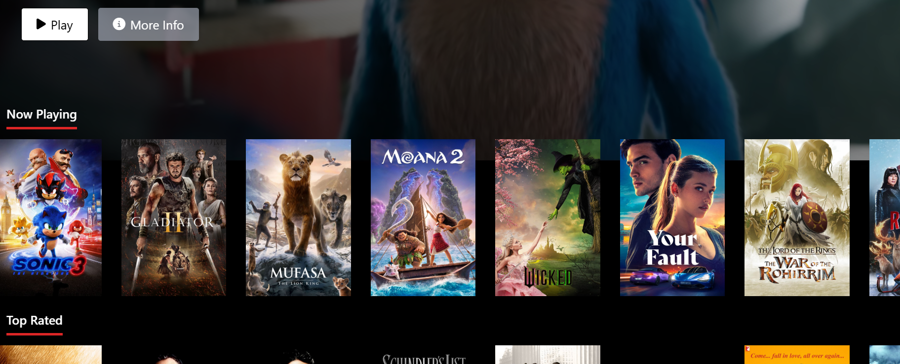

# 🎥 Netflix Gemini

**Netflix Gemini** is an AI-powered movie and TV show discovery web app inspired by Netflix. Built using **React**, **Redux**, and **Firebase**, this platform helps users decide what to watch next based on natural language input like mood, preferences, or genres.

> Unlike a traditional Netflix clone, Netflix Gemini leverages AI to assist users in discovering content that matches their vibe — making movie browsing smarter and more personalized.

---

## ✨ Features

- 🔍 **AI-based Movie Search** – Ask what to watch based on mood or keywords
- 🎬 **Watch Trailers** – View trailers for each title
- 📌 **Personal Watchlist** – Add and manage favorite shows/movies
- 🔐 **Firebase Authentication** – Secure login and user sessions
- 🌐 **Real-time Suggestions** – Uses TMDB and Gemini API for dynamic content

---

## 🚀 Installation

1. **Clone the repository**
   ```bash
   git clone git@github.com:anmolsah/NetflixGemini.git


2. **Install dependencies**

   ```bash
   cd netflix-gemini
   npm install
   ```

3. **Start the development server**

   ```bash
   npm start
   ```

---

## 🧠 Tech Stack

| Tool/Tech  | Purpose                             |
| ---------- | ----------------------------------- |
| React      | Frontend UI                         |
| Redux      | State Management                    |
| Firebase   | Auth & backend                      |
| TMDB API   | Movie & TV data                     |
| Gemini API | AI-based natural language responses |

---

## 🖼 Screenshots





---

## 📄 License

This project is licensed under the **MIT License**.
See the [LICENSE](LICENSE) file for more details.

---

## 🙌 Acknowledgements

* [TMDB](https://www.themoviedb.org/) – For movie and show data
* [Firebase](https://firebase.google.com/) – For backend & auth
* [Google Gemini API](https://ai.google.dev/) – For AI integration

````


